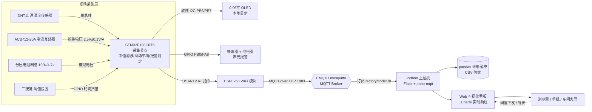

# Smart-Factory-Data-Acquisition-System（智能工厂数据采集系统）

[](https://github.com/lwj15089590118/Smart-Factory-Data-Acquisition-System/actions/workflows/ci.yml)

[](LICENSE)


## 一、项目简介

> **项目定位（请先读）**：本项目为**"固件设计 + 上位机实测验证"**的嵌入式数据采集系统：
> - **固件侧（设计口径）**：`单片机/stm32_code.c` 是按真实硬件（STM32F103C8T6 + DHT11 + ACS712 + ESP-01S）编写的**完整工程代码**——外设时序、滤波、报警状态机、MQTT AT 指令流均为可编译实现；但**未含 Keil 工程文件、未经编译烧录与真机验证**（作者暂无实物，见 FAQ Q4 与 Roadmap）；
> - **上位机侧（实测口径）**：Python 看板与 35 项 pytest 协议互锁测试为**真实运行验证**，可一键复跑；
> - 硬件清单/接线图为**选型设计**，未采购实物；《调试日志》为**设计推演性质的问题对策手册**（演示"现象→排查→根因→措施"方法学），非真机调试记录。

本项目面向小型工厂/车间的**多参数数据采集与可视化**场景。以 **STM32F103C8T6** 为核心采集节点，采集环境**温湿度（DHT11）**、负载**电流（ACS712 霍尔互感器）**与母线**电压（分压电阻网络）**，数据经 **ESP8266（AT 固件）通过 MQTT 协议**上传至 Broker；上位机使用 **Python（Flask + paho-mqtt + pandas）** 订阅数据，并通过 **ECharts** 渲染 Web 实时曲线看板，支持阈值设置、越限报警、历史统计与 CSV 导出。

固件设计中包含 **OLED 本地显示、三按键阈值设置、蜂鸣器/继电器声光报警**，断网时本地照常采集与报警，网络恢复后自动重连（30s 周期），不额外做历史数据补传。

### 核心特性

- 🌡️ 多参数采集：温度、湿度、电流（0~±20A）、电压（0~30V DC）
- 🛡️ 抗干扰设计（设计对策）：ADC 中值滤波 + 滑动平均 + 上电零点自校准，针对数据跳变问题
- 🔔 可靠报警（设计对策）：3 次连续确认 + 5% 迟滞回差，针对阈值误报问题
- 📡 物联网通信：MQTT QoS1 + 心跳保活 + LWT 遗嘱掉线感知 + 自动重连
- 📊 可视化看板：ECharts 实时曲线 / 仪表盘 / 报警事件表 / pandas 统计
- 💾 数据落地：环形缓冲 + 一键导出 CSV
- 🔧 现场可用性设计：OLED 本地显示、按键免 PC 设置阈值、阈值掉电保存（Flash）

## 二、系统架构



## 三、目录结构

```
Smart-Factory-Data-Acquisition-System/
├── README.md                        # 本文件
├── .github/
│   └── workflows/ci.yml             # CI：上位机依赖安装+语法编译+35项pytest（固件不进CI）
├── 单片机/
│   ├── stm32_code.c                 # STM32 采集节点主程序（Keil MDK + 标准外设库）
│   └── 硬件接线图.md                # 全部引脚连接说明（文字 + ASCII 图）
├── Python上位机/
│   ├── dashboard.py                 # Web 看板（Flask + ECharts + MQTT 订阅）
│   ├── requirements.txt             # Python 依赖清单
│   └── tests/                       # pytest 单元测试（数据/报警/协议一致性）
├── 物联网/
│   └── MQTT通信协议.md              # 主题设计、JSON 数据格式、QoS/LWT 规范
├── 电气图纸/
│   └── 数据采集柜布局图.txt         # 采集柜布局（纯文本字符画模拟，非 CAD 二进制）
├── 调试日志/
│   └── 调试问题对策手册.md          # 三类高频问题对策（设计推演口径，见头部声明）
├── 用户手册/
│   └── 操作说明书.md                # 开机顺序/参数设置/报警处理/日常维护
└── resume/
    └── 项目总结.md                  # 500 字第一人称项目总结
```

## 四、技术栈

| 层级 | 选型 | 说明 |
|------|------|------|
| 单片机 | STM32F103C8T6（72MHz, 12位ADC） | 标准外设库 V3.5，Keil MDK 5.36 |
| 传感器 | DHT11 / ACS712-20A / 电阻分压 | 温湿度 / 电流 / 电压 |
| 显示 | 0.96寸 SSD1306 OLED（I2C） | 软件位带 I2C |
| 通信 | ESP8266（AT 固件，MQTT） | USART2 115200bps |
| 协议 | MQTT 3.1.1 | QoS1 + LWT + 心跳重连 |
| 上位机 | Python 3.9+ / Flask / paho-mqtt | 后端订阅 + REST API |
| 可视化 | ECharts 5 | 实时曲线 / 仪表盘 |
| 数据分析 | pandas / numpy | 统计报表 / CSV 导出 |
| Broker | EMQX 或 mosquitto | 内网部署 |

## 五、快速开始

### 1. 部署 MQTT Broker（可选任意一台内网服务器）

固件与看板默认按用户名 `sfda` / 密码 `sfda123` 连接（仅供本地演示；看板侧可用环境变量 `MQTT_USER / MQTT_PASS` 注入覆盖，设为空字符串即匿名连接）。两种常见配置任选其一：

**方式 A：Docker 部署 EMQX 并创建用户**

```bash
docker run -d --name emqx -p 1883:1883 -p 18083:18083 emqx/emqx:latest
# 浏览器打开 http://<服务器IP>:18083（默认 admin/public，建议先改口令）
# 「访问控制 → 认证 → Internal Database」添加用户 sfda / sfda123
```

**方式 B：mosquitto 匿名 Broker（仅限内网测试）**

```bash
# /etc/mosquitto/mosquitto.conf 追加:
#   listener 1883 0.0.0.0
#   allow_anonymous true
mosquitto -c /etc/mosquitto/mosquitto.conf &
# 看板以空凭据匿名连接:
MQTT_USER="" MQTT_PASS="" python dashboard.py --broker 127.0.0.1
```

### 2. 烧录单片机程序

1. 用 Keil MDK 打开工程，将 `单片机/stm32_code.c` 加入工程（需 STM32F10x 标准外设库与 `oledfont.h` 字库文件）；
2. 修改代码顶部的 `WIFI_SSID / WIFI_PASS / BROKER_IP / MQTT_USER / MQTT_PASS` 宏；
3. 编译烧录至 STM32F103C8T6。

### 3. 启动上位机看板

```bash
cd Python上位机
pip install -r requirements.txt
python dashboard.py --broker 192.168.1.100
# 浏览器访问 http://127.0.0.1:5000
```

可选：运行上位机单元测试（数据去重/回退、报警状态机、协议两端一致性回放）：

```bash
cd Python上位机
python -m pytest tests/ -q
```

数据文件口径：`Python上位机/data/history.csv`（列头 `uptime,time,temp,humi,current,voltage,alarm`）
与看板"导出 CSV"接口 `/api/export.csv`（列头 `ts,temp,humi,current,voltage,alarm`）均统一为
**UTF-8 无 BOM** 编码、逗号分隔；读端按 UTF-8 直接解析即可，无需剥离 BOM。

## 六、硬件清单（BOM 选型方案，未采购实物）

| 器件 | 型号/规格 | 数量 |
|------|-----------|------|
| 主控板 | STM32F103C8T6 最小系统板 | 1 |
| 温湿度传感器 | DHT11 | 1 |
| 电流互感器模块 | ACS712-20A（含 RC 滤波） | 1 |
| 电压采样 | 100kΩ + 4.7kΩ 精密电阻（1%），3.3V 稳压管保护 | 各1 |
| 显示 | 0.96寸 I2C OLED（SSD1306） | 1 |
| 通信 | ESP-01S（ESP8266，AT+MQTT 固件） | 1 |
| 报警 | 5V 有源蜂鸣器、5V 继电器模块 | 各1 |
| 人机 | 轻触按键 ×3 | 3 |
| 电源 | 24V 开关电源 + AMS1117-5.0/3.3 | 1套 |

## 七、相关文档

- 通信协议规范：[物联网/MQTT通信协议.md](物联网/MQTT通信协议.md)
- 硬件接线：[单片机/硬件接线图.md](单片机/硬件接线图.md)
- 电气布局：[电气图纸/数据采集柜布局图.txt](电气图纸/数据采集柜布局图.txt)（纯文本字符画模拟）
- 操作手册：[用户手册/操作说明书.md](用户手册/操作说明书.md)
- 调试对策手册：[调试日志/调试问题对策手册.md](调试日志/调试问题对策手册.md)（设计推演口径）

## 八、FAQ（常见问题）

**Q1：上下位机时间怎么对齐？会不会时钟漂移？**

不做全网对时。节点只上报自开机起单调递增的 `uptime` 秒，看板直接以它为数据时间轴；
协议字段与解析顺序**两端互锁**，由 `tests/test_protocol.py` 保证：cmd 方向用纯 Python 复刻
固件 `Cmd_Handle/Cmd_ParseNum/Cmd_ParseId` 的解析器回放、data 方向按固件 `UploadData` 的
printf 格式复刻上行走文，断言两端生效的阈值与入库字段一致。

**Q2：节点断网/断线了怎么办？**

固件解析 `WIFI DISCONNECT` / `+MQTTDISCONNECTED` URC 清连接标志，主循环以 **30s 周期重连**；
重连成功后自动重订阅 cmd 主题并重发 retained `online`（`MQTTCONNCFG` 关闭 clean session，
Broker 侧会话同样保持，双保险）。异常掉线由 LWT 遗嘱让 Broker 代发 retained `offline`，看板
据此感知节点离线。断网期间现场照常采集/显示/报警，历史数据不补传（设计口径，见简介）。

**Q3：上行为什么用 MQTTPUBRAW，status 却用 MQTTPUB？**

`AT+MQTTPUB` 的 data 参数内含引号必须转义且整条命令长度受限；温湿度/电流/电压 JSON 约
115~140 字节、含大量双引号，转义易错，故走 `AT+MQTTPUBRAW` 定长裸数据模式：发命令 → 等
`>` 提示符（阻塞等待，超时 500ms）→ 按声明长度发裸数据（免转义）→ 等 `+MQTTPUB:OK`；数据
末尾**不需要 0x1A**（那是 TCP 透传模式的结束符，计入长度会混入 payload 破坏 JSON）。
status 短报文（约 52 字节）保留 `AT+MQTTPUB` 并正确转义引号。

**Q4：这个项目做过真机吗？固件为什么不能在线编译/进 CI？**

如实说明：**作者暂无实物**，固件未经 Keil 编译与真机验证，当前交付口径是"固件设计 + 上位机实测"。
固件需要 Keil MDK 工程 + STM32F10x 标准外设库 + `oledfont.h` 字库，仓库当前未包含完整工程，
GitHub runner 亦无 ARM/Keil 工具链。因此 CI 只覆盖 Python 上位机（依赖安装 + 语法编译 + 35 项
pytest，每条命令均本机预跑绿后写入）；固件侧以静态审查与 Python 移植仿真验证。下一步计划：补
Keil 工程骨架入库 + 购置最小系统套件完成真机闭环（见 Roadmap 前两项）。

**Q5：统计接口的 NaN 是怎么防的？**

双层防线：① 入库前用 `math.isfinite` 过滤 NaN/Inf，并做物理范围校验（如温度 -50~120°C），
非法报文直接丢弃；② `/api/stats` 对空窗口、单样本（`std` 的 ddof=1 需 n>1）统一返回 `null`、
前端渲染为 `--`——pandas 空序列的 max/min/mean 与单样本 std 均为 NaN，直接 `json.dumps`
会输出非法 JSON 字面量 `NaN`（已修复，含 3 个边界回归用例）。

**Q6：QoS1 重复投递怎么办？**

看板按 `uptime` 单调性去重：与上一条相同或回退不超过 5s 容忍窗口的报文视为 QoS1 重复/乱序
直接丢弃；仅大幅回退才按"节点重启"接受并另起新序列，避免积压旧报文与新数据交错造成曲线跳变。

## 九、Roadmap（如实列示，均为尚未实现）

- [ ] **固件真机验证**：Keil MDK 编译 + ESP-01S 真机联调——发布链路（MQTTPUBRAW）、断线→30s 重连→重订阅→阈值下发/cmd_resp 回执的全链路回归；
- [ ] **Keil 工程入库**：补 `oledfont.h` 与可编译工程骨架，让固件可从仓库复现构建（并扩展 CI 覆盖面）；
- [ ] **OLED 负电流显示修正**：ACS712 双向电流为负时 `I:%d.%02dA` 会拼出 `I:-6.-50A` 畸形，需先取绝对值再拼符号；
- [ ] **协议 §5.1 口径拉齐**：时间戳"大幅回退"在协议文档写"直接丢弃"、代码按"视为节点重启接受"处理，文档与代码二选一对齐；
- [ ] **真机调试证据归档**：真机联调后按对策手册同格式沉淀真实调试记录，并附原始数据（串口 CSV/示波器截图）。

## License

MIT License
