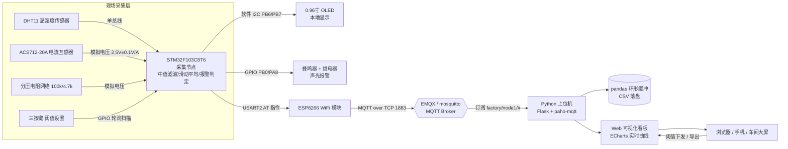

# Smart-Factory-Data-Acquisition-System（智能工厂数据采集系统）


## 一、项目简介

本项目是一套面向小型工厂/车间的**多参数数据采集与可视化系统**。以 **STM32F103C8T6** 为核心采集节点，实时采集环境**温湿度（DHT11）**、负载**电流（ACS712 霍尔互感器）**与母线**电压（分压电阻网络）**，数据经 **ESP8266（AT 固件）通过 MQTT 协议**上传至 Broker；上位机使用 **Python（Flask + paho-mqtt + pandas）** 订阅数据，并通过 **ECharts** 渲染 Web 实时曲线看板，支持阈值设置、越限报警、历史统计与 CSV 导出。

现场侧同时提供 **OLED 本地显示、三按键阈值设置、蜂鸣器/继电器声光报警**，断网时本地照常采集与报警，网络恢复后自动重连（30s 周期），不额外做历史数据补传。

### 核心特性

- 🌡️ 多参数采集：温度、湿度、电流（0~±20A）、电压（0~30V DC）
- 🛡️ 抗干扰设计：ADC 中值滤波 + 滑动平均 + 上电零点自校准，解决数据跳变
- 🔔 可靠报警：3 次连续确认 + 5% 迟滞回差，杜绝阈值误报
- 📡 物联网通信：MQTT QoS1 + 心跳保活 + LWT 遗嘱掉线感知 + 自动重连
- 📊 可视化看板：ECharts 实时曲线 / 仪表盘 / 报警事件表 / pandas 统计
- 💾 数据落地：环形缓冲 + 一键导出 CSV
- 🔧 现场可用：OLED 本地显示、按键免 PC 设置阈值、阈值掉电保存（Flash）

## 二、系统架构



## 三、目录结构

```
Smart-Factory-Data-Acquisition-System/
├── README.md                        # 本文件
├── 单片机/
│   ├── stm32_code.c                 # STM32 采集节点主程序（Keil MDK + 标准外设库）
│   └── 硬件接线图.md                # 全部引脚连接说明（文字 + ASCII 图）
├── Python上位机/
│   ├── dashboard.py                 # Web 看板（Flask + ECharts + MQTT 订阅）
│   ├── requirements.txt             # Python 依赖清单
│   └── tests/                       # pytest 单元测试（数据/报警/协议一致性）
├── 物联网/
│   └── MQTT通信协议.md              # 主题设计、JSON 数据格式、QoS/LWT 规范
├── 电气图纸/
│   └── 数据采集柜布局图.txt         # 采集柜布局（纯文本字符画模拟，非 CAD 二进制）
├── 调试日志/
│   └── 调试记录.md                  # 15 天调试记录（数据跳变/通信断连/阈值误报）
├── 用户手册/
│   └── 操作说明书.md                # 开机顺序/参数设置/报警处理/日常维护
└── resume/
    └── 项目总结.md                  # 500 字第一人称项目总结
```

## 四、技术栈

| 层级 | 选型 | 说明 |
|------|------|------|
| 单片机 | STM32F103C8T6（72MHz, 12位ADC） | 标准外设库 V3.5，Keil MDK 5.36 |
| 传感器 | DHT11 / ACS712-20A / 电阻分压 | 温湿度 / 电流 / 电压 |
| 显示 | 0.96寸 SSD1306 OLED（I2C） | 软件位带 I2C |
| 通信 | ESP8266（AT 固件，MQTT） | USART2 115200bps |
| 协议 | MQTT 3.1.1 | QoS1 + LWT + 心跳重连 |
| 上位机 | Python 3.9+ / Flask / paho-mqtt | 后端订阅 + REST API |
| 可视化 | ECharts 5 | 实时曲线 / 仪表盘 |
| 数据分析 | pandas / numpy | 统计报表 / CSV 导出 |
| Broker | EMQX 或 mosquitto | 内网部署 |

## 五、快速开始

### 1. 部署 MQTT Broker（可选任意一台内网服务器）

固件与看板默认按用户名 `sfda` / 密码 `sfda123` 连接（仅供本地演示；看板侧可用环境变量 `MQTT_USER / MQTT_PASS` 注入覆盖，设为空字符串即匿名连接）。两种常见配置任选其一：

**方式 A：Docker 部署 EMQX 并创建用户**

```bash
docker run -d --name emqx -p 1883:1883 -p 18083:18083 emqx/emqx:latest
# 浏览器打开 http://<服务器IP>:18083（默认 admin/public，建议先改口令）
# 「访问控制 → 认证 → Internal Database」添加用户 sfda / sfda123
```

**方式 B：mosquitto 匿名 Broker（仅限内网测试）**

```bash
# /etc/mosquitto/mosquitto.conf 追加:
#   listener 1883 0.0.0.0
#   allow_anonymous true
mosquitto -c /etc/mosquitto/mosquitto.conf &
# 看板以空凭据匿名连接:
MQTT_USER="" MQTT_PASS="" python dashboard.py --broker 127.0.0.1
```

### 2. 烧录单片机程序

1. 用 Keil MDK 打开工程，将 `单片机/stm32_code.c` 加入工程（需 STM32F10x 标准外设库与 `oledfont.h` 字库文件）；
2. 修改代码顶部的 `WIFI_SSID / WIFI_PASS / BROKER_IP / MQTT_USER / MQTT_PASS` 宏；
3. 编译烧录至 STM32F103C8T6。

### 3. 启动上位机看板

```bash
cd Python上位机
pip install -r requirements.txt
python dashboard.py --broker 192.168.1.100
# 浏览器访问 http://127.0.0.1:5000
```

可选：运行上位机单元测试（数据去重/回退、报警状态机、协议两端一致性回放）：

```bash
cd Python上位机
python -m pytest tests/ -q
```

数据文件口径：`Python上位机/data/history.csv`（列头 `uptime,time,temp,humi,current,voltage,alarm`）
与看板"导出 CSV"接口 `/api/export.csv`（列头 `ts,temp,humi,current,voltage,alarm`）均统一为
**UTF-8 无 BOM** 编码、逗号分隔；读端按 UTF-8 直接解析即可，无需剥离 BOM。

## 六、硬件清单（BOM 摘要）

| 器件 | 型号/规格 | 数量 |
|------|-----------|------|
| 主控板 | STM32F103C8T6 最小系统板 | 1 |
| 温湿度传感器 | DHT11 | 1 |
| 电流互感器模块 | ACS712-20A（含 RC 滤波） | 1 |
| 电压采样 | 100kΩ + 4.7kΩ 精密电阻（1%），3.3V 稳压管保护 | 各1 |
| 显示 | 0.96寸 I2C OLED（SSD1306） | 1 |
| 通信 | ESP-01S（ESP8266，AT+MQTT 固件） | 1 |
| 报警 | 5V 有源蜂鸣器、5V 继电器模块 | 各1 |
| 人机 | 轻触按键 ×3 | 3 |
| 电源 | 24V 开关电源 + AMS1117-5.0/3.3 | 1套 |

## 七、相关文档

- 通信协议规范：[物联网/MQTT通信协议.md](物联网/MQTT通信协议.md)
- 硬件接线：[单片机/硬件接线图.md](单片机/硬件接线图.md)
- 电气布局：[电气图纸/数据采集柜布局图.txt](电气图纸/数据采集柜布局图.txt)（纯文本字符画模拟）
- 操作手册：[用户手册/操作说明书.md](用户手册/操作说明书.md)
- 调试档案：[调试日志/调试记录.md](调试日志/调试记录.md)

## License

MIT License
